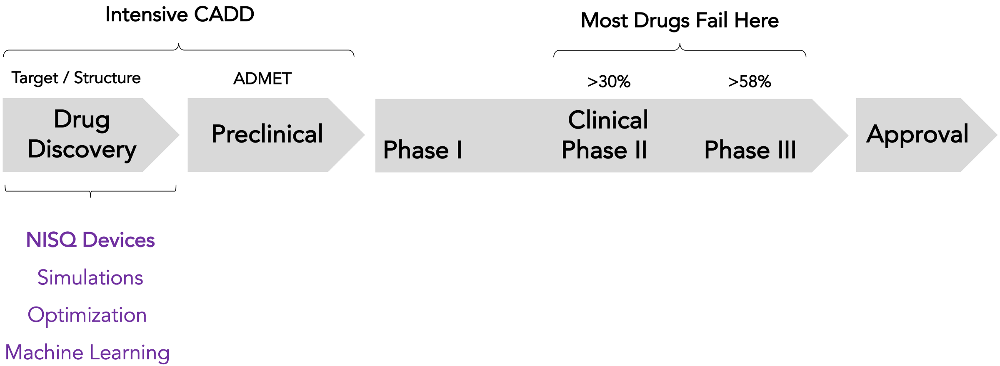

# InSilicoQ

**InSilicoQ** is a __Quantum Computation__ based package for various steps in __Drug Design and Discovery__. Drug design is a highly complicated process and It involves lots of steps. By InSilicoQ, we aim to utilize Quantum Computing for faster Virtual Screening, Small Molecule and De Novo drug design. 

## A few words about Quantum Computing

Quantum commuting is emerging as a powerful computational model. The main algorithms implemented in the package consist of Variational Quantum Algorithms (VQA)
and Quantum Machine Learning Algorithms. The package is intended to contain the following algorithms: 

* Variational Quantum Algorithms (VQA)
* Quantum Principal Component Analysis(QPCA)
* Quantum-Kmean
* Quantum Neural Networks
* Quantum Kernel Methods

## A few words about Drug Design 
The applications included in the first steps are to use the speedup offered by Quantum Algorithms mentioned above for experimnting on diffrent datasets ( __Genome Sequencing__, ... ). 

## Technologies
The project uses __Qiskit__ for performing Quantum Computation routines which is a __IBM SDK__. The __Colab Notebook__ provides a guide how to use the integrated packages. Integrated Tools and Datasets:

* Qiskit
* Rdkit
* Pubchem API
* ChEMBL API

## Installation

## Project Status
 In progress ... (Quantum Kernel methods Added)  

## References
[1]- https://qiskit.org/documentation/
[2]- Suzuki, Y., Yano, H., Gao, Q. et al. Analysis and synthesis of feature map for kernel-based quantum classifier. Quantum Mach. Intell. 2, 9 (2020). https://doi.org/10.1007/s42484-020-00020-y
[3]- Havlíček, V., Córcoles, A.D., Temme, K. et al. Supervised learning with quantum-enhanced feature spaces. Nature 567, 209–212 (2019). https://doi.org/10.1038/s41586-019-0980-2
[4]- https://qiskit.org/documentation/machine-learning/tutorials/03_quantum_kernel.html

